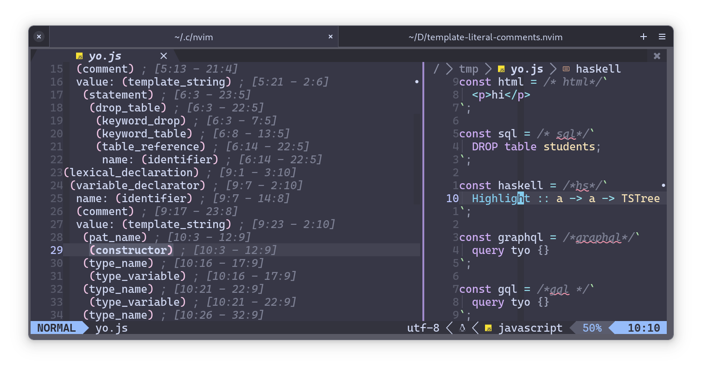

# template-literal-comments.nvim

Highlight ECMAScript template literals by placing a comment before them



```lua
return { 'bennypowers/template-literal-comments.nvim',
  opts = true,
  ft = {
    'javascript',
    'typescript',
  }
}
```
